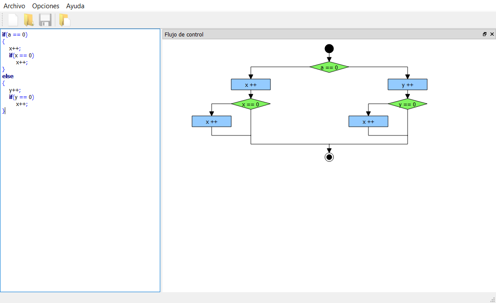
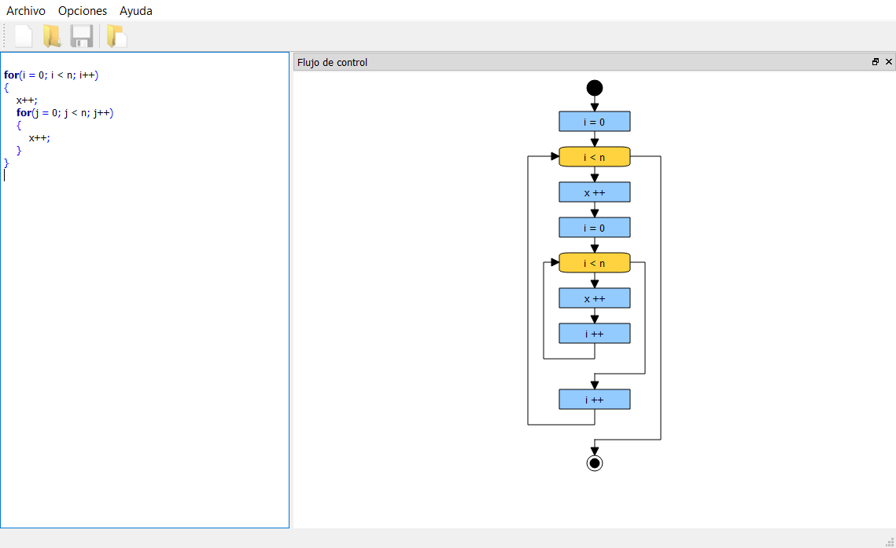
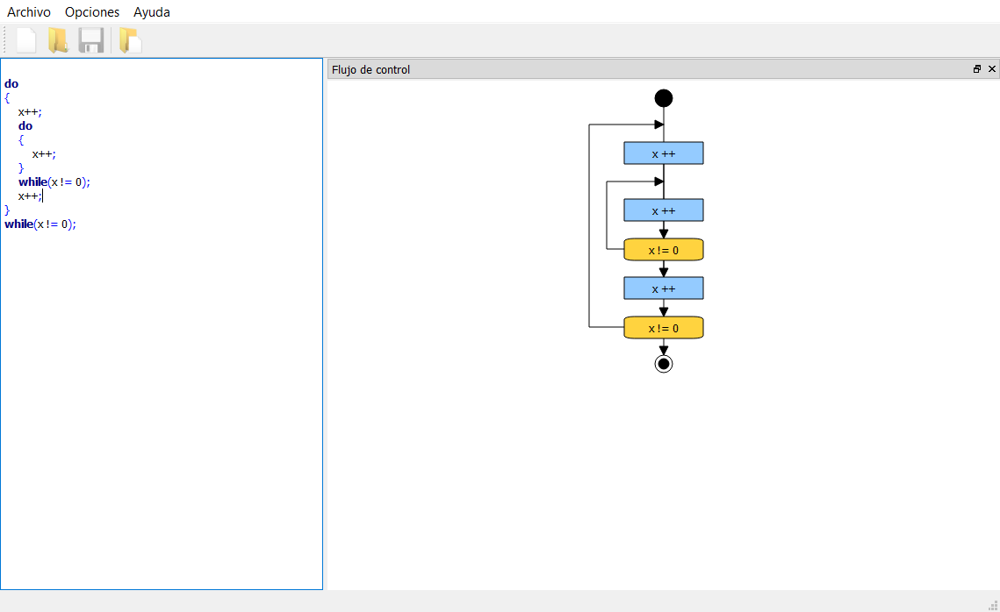

# Control Flow

**ControlFlow** es un programa que a través de un código del estilo C, se genera un gráfico del control del flujo de las instrucciones.
Las sentencias de control implementadas son:

* **if-else**
* **for**
* **while**
* **do-while**

Screenshots:

